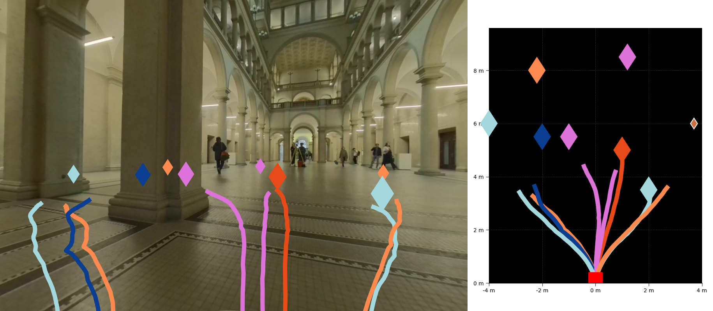
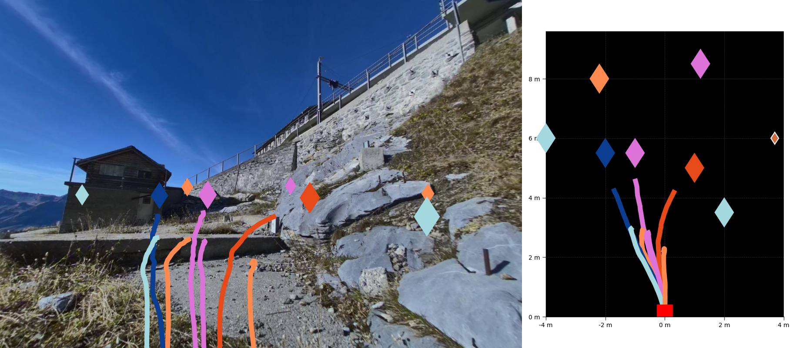
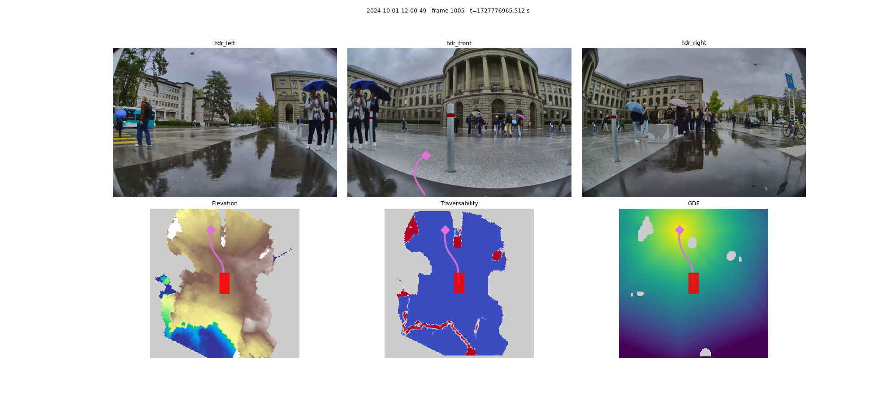

<h1 align="center">Less is More 🍋: Scalable Visual Navigation<br>from Limited Data</h1>

<p align="center">
📄 <a href="https://arxiv.org/pdf/2601.17815">Paper</a> | 🌐 <a href="https://leggedrobotics.github.io/less-is-more/">Project Page</a> | 🤗 <a href="https://huggingface.co/yv1es/less-is-more">Weights</a> | 📊 <a href="https://huggingface.co/datasets/leggedrobotics/grand_tour_dataset">Dataset</a>
</p>

**Less is More (LiMo)** is a transformer-based visual navigation policy that predicts goal-conditioned SE(2) trajectories from a single RGB observation. We demonstrate that augmenting limited expert demonstrations with geometric planner-generated trajectories yields substantial performance improvements, achieving robust visual navigation through strategic data curation rather than simply collecting more data.

## Release Status

- [x] Inference code
- [x] Checkpoints released (SafeTensors on HuggingFace)
- [x] Dataset and training code
- [x] Dataset builder with MPPI planner
- [ ] ROS integration

## Installation

This project uses [uv](https://docs.astral.sh/uv/) for dependency management. Tested on Ubuntu 22.04, Python 3.10, NVIDIA GPU with driver version ≥530 (CUDA 12.1).

```bash
git clone https://github.com/leggedrobotics/less-is-more && cd less-is-more && uv sync
```

To also use the dataset builder:

```bash
uv sync --extra dataset_builder
```

> **Note**: The `dataset_builder` extra is only supported on **Linux x86_64 with Python 3.10**. It vendors a pre-built [FastGeodis](https://github.com/masadcv/FastGeodis) wheel because `pip install FastGeodis` requires a from-source CUDA build that is broken in the standard distribution.

The codebase uses [Hydra](https://hydra.cc/) for configuration management in the `limo` package.

### Download Pretrained Weights

Download the pretrained LiMo checkpoint:

```bash
wget -O data/weights/limo_trained_on_D_aug.safetensors \
  https://huggingface.co/yv1es/less-is-more/resolve/main/limo_trained_on_D_aug.safetensors
```

## Quick Start

Run inference on the provided examples:

```bash
uv run limo/src/inference.py
```

The default configuration in `limo/configs/inference.yaml` processes images from the example dataset in `data/inference_example/`.

<div align="center">
  
  <p><i>Example: Inside ETH Zurich main building with multiple predictions</i></p>
</div>

<div align="center">
  
  <p><i>Example: Outdoor mountain trail with multiple predictions</i></p>
</div>

### Configuration

The inference pipeline is configured via `limo/configs/inference.yaml`:

- `weights_path`: Path to model weights (default: `data/weights/limo_trained_on_D_aug.safetensors`)
- `input_path`: Single image file or directory containing `.jpg`, `.png`, or `.jpeg` files
- `goals_csv`: CSV file defining navigation targets (format: `x,y,yaw` in meters/radians, robot frame)
- `camera_info`: Optional YAML file with camera intrinsics for path projection visualization
- `output_dir`: Directory for generated visualizations

See `data/inference_example/` for a complete working example with sample images, goals, and camera calibration.

## Training

The training pipeline uses [PyTorch Lightning](https://lightning.ai/) for model training and [Hydra](https://hydra.cc/) for configuration management.

### Training Script

Train the model using: :

```bash
uv run limo/src/train.py experiment=train_limo_debug
```

(this debug experiment config will only start a quick debug run to test your system)

The main entry point is `limo/src/train.py`, which:

- Loads configuration from `limo/configs/train.yaml` and an experiment config
- Automatically pulls the dataset from HuggingFace
- Runs training with logging
- Saves checkpoints and weights

### Configuration System

The training pipeline uses Hydra with the following structure:

**Config directories** (`limo/configs/`):

- `data/`: Dataset configuration (e.g., `limo.yaml` - LimoDataModule settings)
- `model/`: Model architecture (e.g., `limo.yaml` - network configuration)
- `trainer/`: PyTorch Lightning trainer settings
- `logger/`: Logging backends (e.g., wandb, csv)
- `callbacks/`: Training callbacks (e.g., checkpointing)
- `experiment/`: Complete experiment configs that override defaults

**Experiment configs** (`limo/configs/experiment/`):

- `train_limo_debug.yaml`: Quick debug run with 5 epochs, limited batches
- `train_limo_on_D_aug.yaml`: Full training on augmented dataset
- `train_limo_side_cams.yaml`: Training with side camera inputs

Override configs using the Hydra syntax:

```bash
# Use a specific experiment
uv run limo/src/train.py experiment=train_limo_on_D_aug

# Override specific parameters
uv run limo/src/train.py experiment=train_limo_debug data.batch_size=32 trainer.max_epochs=10

# Disable wandb logging
uv run limo/src/train.py experiment=train_limo_debug logger=null
```

By default, training uses [Weights & Biases](https://wandb.ai/) for logging.

### Checkpoints and Weights

- **Checkpoints**: Saved to `logs/train/runs/<timestamp>/checkpoints/` (PyTorch Lightning format)
- **SafeTensors weights**: Automatically converted and saved to `logs/train/runs/<timestamp>/weights/` after each checkpoint

## Dataset Builder

The `dataset_builder` package generates training samples from Grand Tour missions. It runs the MPPI geometric planner over pre-computed elevation maps to produce goal-conditioned paths, writing output in the same zarr format consumed by the training pipeline. Required topics are downloaded from HuggingFace automatically.

### Quick start: build and train on 3 missions

```bash
# Build geo + tel paths for 3 missions - ETH outdoor, Jungfraujoch, Construction site
# (1 path/frame, skips first 1000 frames)
uv run dataset_builder/src/build_paths.py --config-name build_example dataset_type=geo
uv run dataset_builder/src/build_paths.py --config-name build_example dataset_type=tel

# Train on the result with aug (geo + tel), 5 epochs, CSV logger — no WandB needed
uv run limo/src/train.py experiment=train_limo_local_example
```

Output goes to `data/dataset_builder/`. `experiment=train_limo_local_example` selects `dataset=limo_local_example` (points at the three example missions, `dataset_type=aug`) and switches the logger to CSV.

### Full build (all missions, as in the paper)

```bash
# D_geo: 10 paths per frame across all 48 missions
uv run dataset_builder/src/build_paths.py dataset_type=geo

# D_tel: teleoperation paths
uv run dataset_builder/src/build_paths.py dataset_type=tel
```

Then train on all missions:

```bash
uv run limo/src/train.py experiment=train_limo_local
```

### Visualization

Pass `viz=true` to watch the planner and maps live while building:

```bash
uv run dataset_builder/src/build_paths.py --config-name build_example dataset_type=geo viz=true
```

The viewer shows elevation, traversability, and GDF maps in the bottom row, and camera images in the top row. Side camera images are included automatically if they were already downloaded (see below); if not, those panels are left blank without failing. The display updates every 5 frames (`viz_every: 5`); override with e.g. `viz_every=1` on the command line.



### Side cameras

By default only the front camera and odometry are downloaded. To also pull the left and right cameras — required for training the side-camera model variant — pass `fetch_side_cams=true`:

```bash
uv run dataset_builder/src/build_paths.py --config-name build_example dataset_type=geo fetch_side_cams=true
uv run dataset_builder/src/build_paths.py --config-name build_example dataset_type=tel fetch_side_cams=true
```

Side camera data is then available for `experiment=train_limo_side_cams`.

> **Note on data availability**: The elevation maps (`elevation_revision: refs/pr/9`) and the pre-built LiMo path zarrs (`HF_REVISION_LIMO = "refs/pr/6"`) live on open HuggingFace PRs against `leggedrobotics/grand_tour_dataset` that have not yet been merged to `main`. The dataset builder downloads from these PR branches automatically; they will be updated to point at `main` once the PRs are merged.

## Dataset

LiMo's training data is based on **Grand Tour dataset** from HuggingFace: [`leggedrobotics/grand_tour_dataset`](https://huggingface.co/datasets/leggedrobotics/grand_tour_dataset)
We added LiMo's data to the same HuggingFace repo.

> **Note**: The dataset is **automatically pulled** from HuggingFace. No manual download required!

### Dataset Types

The Grand Tour dataset contains multiple mission recordings. Different sample types can be extracted:

- **Teleoperation samples (`tel`)**: Expert demonstrations from human teleoperation
- **Geometric samples (`geo`)**: Trajectories generated by the MPPI geometric planner
- **Augmented samples (`aug`)**: Combined set of teleoperation + geometric samples

Select the dataset type using the `get_dataset()` method in `dataset/src/limo_datset.py`:

```python
from dataset.src.limo_datset import get_dataset

# Load teleoperation samples only
dataset_tel = get_dataset(
    dataset_type="tel",           # or "geo", "aug"
    dataset_folder="data/dataset",
    missions_csv="missions_split.csv",
    with_side_cams=True
)

# Load augmented samples with side cameras
dataset_aug = get_dataset(
    dataset_type="aug",
    dataset_folder="data/dataset",
    missions_csv="missions_split.csv",
    with_side_cams=True
)
```

### Missions and Train/Val/Test Split

The `missions_split.csv` file controls which missions are used and how they're split:

**CSV Format**:

```
Mission,Timestamp,Split
grandtour_mission_1,2024-01-15,train
grandtour_mission_2,2024-01-16,val
grandtour_mission_3,2024-01-17,test
```

**Usage**:

- Include only specific missions by adding rows to the CSV
- Control split ratios by adjusting the number of missions per split
- Quick start: use `missions_split_example.csv` (3 missions: train/val/test, used by `train_limo_local`)

## Citation

If you use this work in your research, please cite:

```bibtex
@misc{inglin2026morescalablevisualnavigation,
      title={Less Is More: Scalable Visual Navigation from Limited Data},
      author={Yves Inglin and Jonas Frey and Changan Chen and Marco Hutter},
      year={2026},
      eprint={2601.17815},
      archivePrefix={arXiv},
      primaryClass={cs.RO},
      url={https://arxiv.org/abs/2601.17815},
}
```
